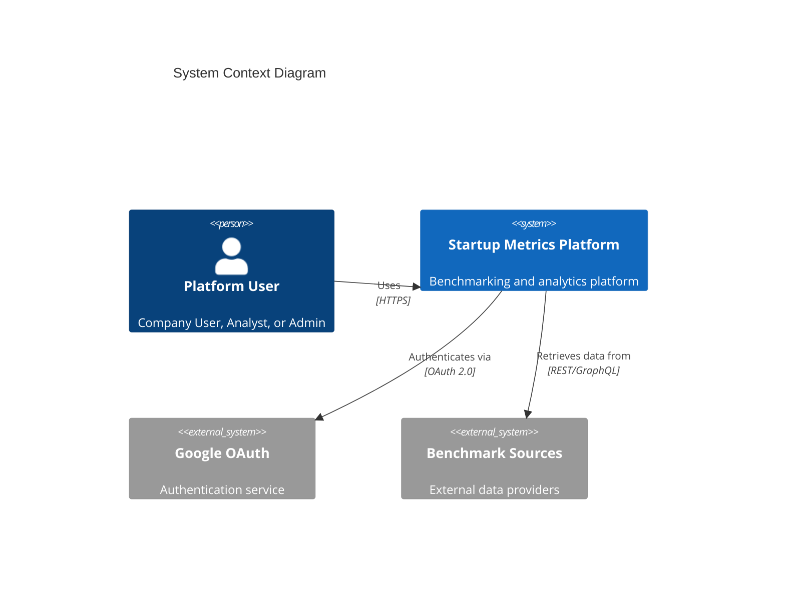
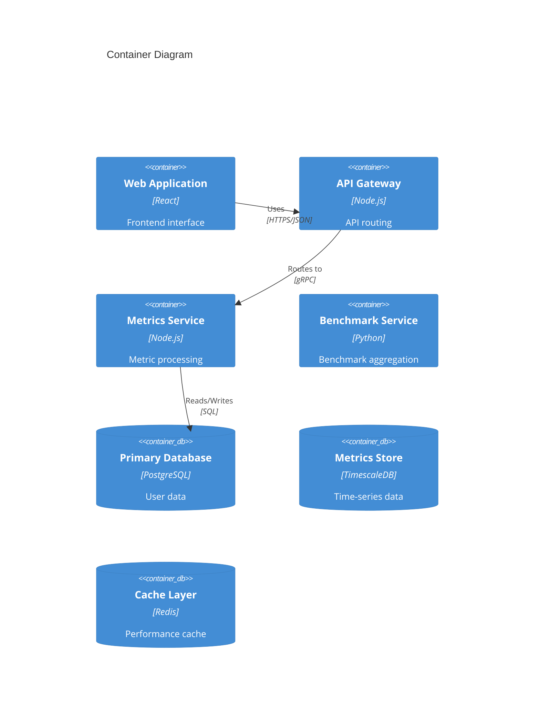
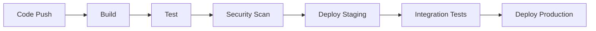

# Startup Metrics Benchmarking Platform

[](https://github.com/workflow/status)
[](https://codecov.io/coverage)
[](https://opensource.org/licenses/MIT)

A comprehensive web-based platform providing startup companies with benchmark data and personalized comparisons across key performance metrics.

## Project Overview

The Startup Metrics Benchmarking Platform enables companies to:
- Compare performance against industry benchmarks
- Track and analyze key startup metrics
- Generate customized benchmark reports
- Access revenue-based filtering and segmentation
- Secure company-specific metric tracking

### Target Audience
- Startup executives
- Financial analysts
- Industry researchers
- Business strategists

### Technology Stack
- Frontend: React, TypeScript, Material-UI
- Backend: Node.js, Python
- Databases: PostgreSQL, TimescaleDB, Redis
- Infrastructure: AWS, Docker, Kubernetes

## Architecture



### Component Architecture



## Getting Started

### Prerequisites
- Node.js 20.x LTS
- Python 3.11+
- Docker 24.0+
- AWS CLI 2.x

### Installation

1. Clone the repository:
```bash
git clone https://github.com/organization/startup-metrics-platform.git
cd startup-metrics-platform
```

2. Install dependencies:
```bash
npm install
```

3. Configure environment:
```bash
cp .env.example .env
# Edit .env with your configuration
```

4. Start development environment:
```bash
docker-compose up -d
npm run dev
```

### Environment Variables

| Variable | Description | Required |
|----------|-------------|----------|
| `NODE_ENV` | Environment (development/staging/production) | Yes |
| `DATABASE_URL` | PostgreSQL connection string | Yes |
| `REDIS_URL` | Redis connection string | Yes |
| `AWS_REGION` | AWS region for services | Yes |
| `GOOGLE_CLIENT_ID` | OAuth 2.0 client ID | Yes |

## Development

### Code Structure
```
├── src/
│   ├── api/          # API services
│   ├── components/   # React components
│   ├── services/     # Business logic
│   ├── utils/        # Utilities
│   └── types/        # TypeScript definitions
├── tests/            # Test suites
├── docs/             # Documentation
└── infrastructure/   # IaC templates
```

### Coding Standards
- ESLint configuration
- Prettier formatting
- TypeScript strict mode
- Jest for testing
- 90% minimum test coverage

### Local Development
1. Start development server:
```bash
npm run dev
```

2. Run tests:
```bash
npm run test
```

3. Build production:
```bash
npm run build
```

## Deployment

### CI/CD Pipeline



### Environments
- Development: Feature development
- Staging: Pre-production testing
- Production: Live environment

### Infrastructure
- AWS ECS Fargate for containers
- RDS for PostgreSQL
- ElastiCache for Redis
- CloudFront for CDN
- Route53 for DNS

## API Documentation

### Authentication
- Google OAuth 2.0
- JWT tokens
- Role-based access control

### Key Endpoints

| Endpoint | Method | Description |
|----------|--------|-------------|
| `/api/v1/metrics` | GET | Retrieve metrics |
| `/api/v1/benchmarks` | GET | Get benchmark data |
| `/api/v1/companies` | GET | List companies |

Full API documentation available at `/api/docs` (Swagger UI)

## Contributing

### Pull Request Process
1. Fork the repository
2. Create feature branch
3. Commit changes
4. Push to fork
5. Create Pull Request

### Code Review Requirements
- Passes all tests
- Maintains code coverage
- Follows coding standards
- Includes documentation
- Security compliance

## License

This project is licensed under the MIT License - see the [LICENSE](LICENSE) file for details.

### Third-Party Licenses
- React: MIT
- Node.js: MIT
- Material-UI: MIT
- mermaid-js: MIT (v10.6.0)

## Support

- Documentation: `/docs`
- Issues: GitHub Issues
- Security: security@example.com
- Community: Slack channel

---
Generated with care by the Startup Metrics Platform team.