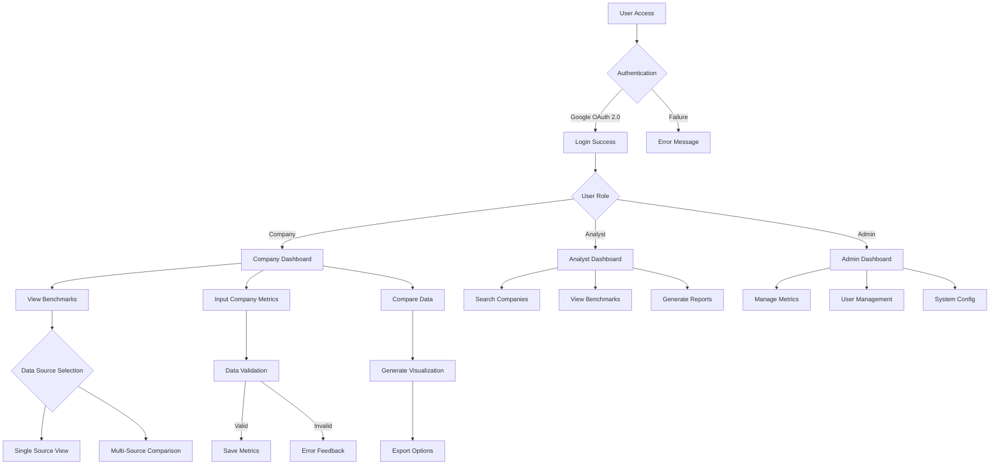
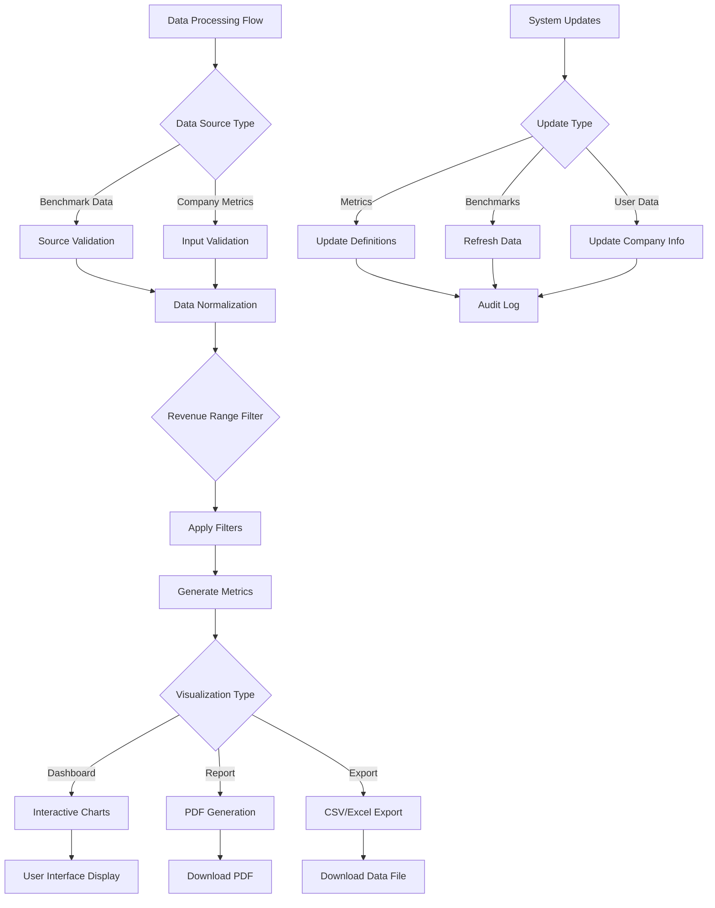
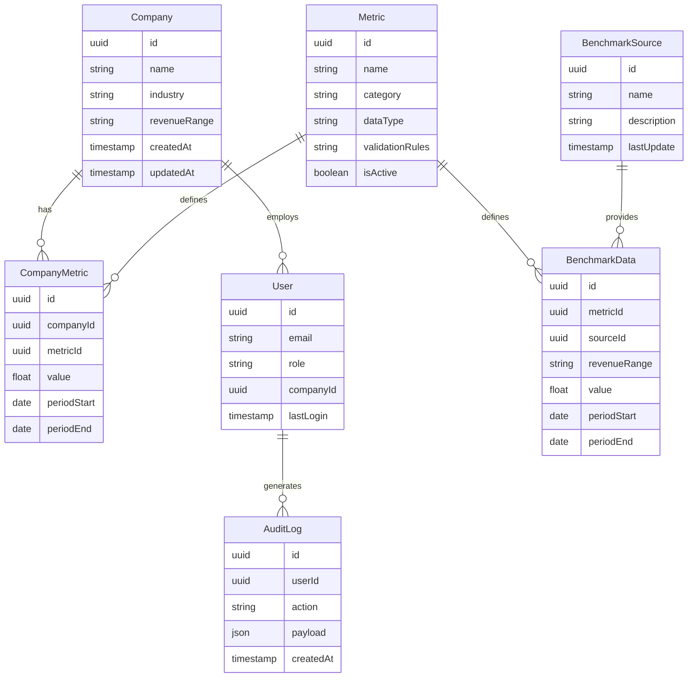
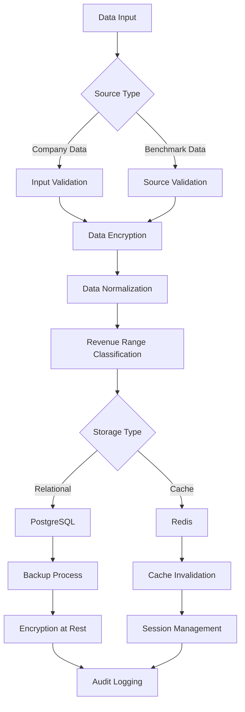

# Product Requirements Document (PRD)

# 1. INTRODUCTION

## 1.1 PURPOSE

This Product Requirements Document (PRD) serves as the authoritative reference for the development of a web-based startup metrics benchmarking platform. It is intended for:

- Development teams implementing the technical solution
- Product managers overseeing feature development
- UX/UI designers creating the user interface
- Quality assurance teams validating functionality
- Stakeholders evaluating project progress and alignment

## 1.2 SCOPE

The startup metrics benchmarking platform will provide:

- Comprehensive benchmark data visualization and comparison tools
- Role-based access for companies, analysts, and administrators
- Integration of multiple benchmark data sources
- Company-specific metric tracking and comparison capabilities
- Administrative controls for metric management
- Secure authentication and data handling

Key functionalities include:

- Interactive dashboards with revenue-based filtering
- Side-by-side comparison of benchmark sources
- Custom metric input and tracking
- Data export and reporting features
- White-label branding options
- Role-specific interfaces and permissions
- Google OAuth 2.0 authentication
- Compliance with data privacy regulations

The platform will not include:

- Direct data collection from company systems
- Real-time financial data integration
- Predictive analytics or forecasting
- Investment or valuation services
- Third-party marketplace integrations

# 2. PRODUCT DESCRIPTION

## 2.1 PRODUCT PERSPECTIVE

The startup metrics benchmarking platform operates as a standalone web application that integrates with:

- Google OAuth 2.0 for authentication services
- Cloud-based database systems for storing benchmark and company data
- Data encryption services for security compliance
- External benchmark data sources for industry metrics

The system architecture follows a modern web application structure with:

- Frontend web interface for user interactions
- Backend API services for data processing
- Secure database layer for data persistence
- Authentication middleware for access control

## 2.2 PRODUCT FUNCTIONS

The platform provides these core functions:

1. Benchmark Data Management
   - Display of multiple benchmark data sources
   - Side-by-side comparison capabilities
   - Revenue-based filtering and segmentation

2. Company Metric Tracking
   - Custom metric input and storage
   - Comparison against benchmark data
   - Historical tracking and trending

3. Role-Based Access Control
   - Company user functions
   - Analyst research capabilities
   - Administrative controls

4. Data Visualization
   - Interactive dashboards
   - Customizable charts and graphs
   - Export functionality

5. Administrative Tools
   - Metric definition and management
   - User access control
   - System configuration

## 2.3 USER CHARACTERISTICS

### Primary User Personas

1. Company Users
   - Startup founders and executives
   - Financial analysts within companies
   - Technical expertise: Moderate
   - Frequency: Regular access for metric tracking

2. Industry Analysts
   - Investment professionals
   - Market researchers
   - Technical expertise: High
   - Frequency: Heavy daily usage

3. System Administrators
   - Platform management staff
   - Technical expertise: Very high
   - Frequency: As needed for maintenance

## 2.4 CONSTRAINTS

1. Technical Constraints
   - Must support modern web browsers (Chrome, Firefox, Safari, Edge)
   - Response time < 2 seconds for data retrieval
   - 99.9% system uptime requirement

2. Regulatory Constraints
   - GDPR compliance required
   - CCPA compliance required
   - Data residency requirements for EU users

3. Business Constraints
   - White-label functionality must preserve core features
   - Integration limited to Google OAuth 2.0
   - No direct financial system integrations

## 2.5 ASSUMPTIONS AND DEPENDENCIES

### Assumptions
1. Users have stable internet connectivity
2. Companies will maintain current revenue range data
3. Benchmark data sources remain available
4. Users have Google accounts for authentication

### Dependencies
1. Google OAuth 2.0 service availability
2. Third-party benchmark data source reliability
3. Cloud infrastructure service continuity
4. Modern browser compatibility
5. Encryption service availability

# 3. PROCESS FLOWCHART





# 4. FUNCTIONAL REQUIREMENTS

## 4.1 Authentication and User Management

### ID: FR-1
### Description: User authentication and role-based access control system
### Priority: High

| Requirement ID | Requirement Description | Acceptance Criteria |
|---------------|------------------------|-------------------|
| FR-1.1 | Implement Google OAuth 2.0 authentication | - Successful login with Google credentials<br>- Token management and refresh<br>- Secure session handling |
| FR-1.2 | Role-based access control | - Support for Company, Analyst, and Admin roles<br>- Role-specific dashboard access<br>- Permission-based feature restrictions |
| FR-1.3 | User profile management | - Profile information editing<br>- Password reset functionality<br>- Account deactivation options |

## 4.2 Benchmark Data Management

### ID: FR-2
### Description: Management and display of benchmark data from multiple sources
### Priority: High

| Requirement ID | Requirement Description | Acceptance Criteria |
|---------------|------------------------|-------------------|
| FR-2.1 | Multiple benchmark source integration | - Support for multiple data sources<br>- Clear source attribution<br>- Data freshness indicators |
| FR-2.2 | Revenue-based filtering | - Dynamic revenue range selection<br>- Automatic data filtering<br>- Clear filter status display |
| FR-2.3 | Side-by-side comparison | - Multiple source comparison view<br>- Highlight data inconsistencies<br>- Source selection controls |

## 4.3 Company Metric Tracking

### ID: FR-3
### Description: Company-specific metric input and comparison functionality
### Priority: High

| Requirement ID | Requirement Description | Acceptance Criteria |
|---------------|------------------------|-------------------|
| FR-3.1 | Custom metric input | - Metric validation rules<br>- Historical data tracking<br>- Bulk import capabilities |
| FR-3.2 | Benchmark comparison | - Side-by-side visualization<br>- Variance highlighting<br>- Trend analysis |
| FR-3.3 | Data export | - CSV/Excel export options<br>- PDF report generation<br>- Custom report formatting |

## 4.4 Dashboard and Visualization

### ID: FR-4
### Description: Interactive dashboard and data visualization features
### Priority: Medium

| Requirement ID | Requirement Description | Acceptance Criteria |
|---------------|------------------------|-------------------|
| FR-4.1 | Interactive charts | - Multiple chart types<br>- Dynamic data updates<br>- Customizable views |
| FR-4.2 | Metric categorization | - Organized metric hierarchy<br>- Category-based filtering<br>- Custom category creation |
| FR-4.3 | Dashboard customization | - Layout customization<br>- Saved view preferences<br>- Widget configuration |

## 4.5 Administrative Controls

### ID: FR-5
### Description: System administration and configuration features
### Priority: Medium

| Requirement ID | Requirement Description | Acceptance Criteria |
|---------------|------------------------|-------------------|
| FR-5.1 | Metric definition management | - Create/edit/delete metrics<br>- Validation rule configuration<br>- Metric visibility controls |
| FR-5.2 | User management | - User account administration<br>- Role assignment<br>- Access control configuration |
| FR-5.3 | System configuration | - White-label settings<br>- System parameters<br>- Audit logging |

## 4.6 Data Security and Compliance

### ID: FR-6
### Description: Security features and compliance requirements
### Priority: High

| Requirement ID | Requirement Description | Acceptance Criteria |
|---------------|------------------------|-------------------|
| FR-6.1 | Data encryption | - Encryption at rest<br>- Encryption in transit<br>- Key management |
| FR-6.2 | Compliance features | - GDPR compliance tools<br>- CCPA compliance tools<br>- Data residency controls |
| FR-6.3 | Audit logging | - User action tracking<br>- System event logging<br>- Compliance reporting |

# 5. NON-FUNCTIONAL REQUIREMENTS

## 5.1 Performance Requirements

| Requirement | Description | Target Metric |
|------------|-------------|---------------|
| Response Time | Maximum time for page load and data retrieval | < 2 seconds |
| API Response | Maximum time for API endpoint responses | < 500ms |
| Concurrent Users | Number of simultaneous users supported | 1000+ |
| Database Query Time | Maximum time for complex benchmark queries | < 1 second |
| Chart Rendering | Maximum time to render interactive visualizations | < 1 second |
| Export Generation | Maximum time for report/data export creation | < 30 seconds |

## 5.2 Safety Requirements

| Requirement | Description | Implementation |
|------------|-------------|----------------|
| Data Backup | Regular automated backups of all system data | Daily incremental, Weekly full |
| Disaster Recovery | Recovery point and time objectives | RPO: 24 hours, RTO: 4 hours |
| Failover Systems | Automatic system failover capabilities | Multi-zone deployment |
| Data Validation | Input validation to prevent data corruption | Server-side validation |
| Error Handling | Graceful error handling and user notification | Structured error responses |
| Session Management | Secure session handling and timeout | 30-minute idle timeout |

## 5.3 Security Requirements

| Requirement | Description | Implementation |
|------------|-------------|----------------|
| Authentication | Google OAuth 2.0 implementation | JWT tokens with refresh |
| Authorization | Role-based access control | Granular permission system |
| Data Encryption | Encryption for data at rest and in transit | AES-256 / TLS 1.3 |
| API Security | Secure API access and rate limiting | 1000 requests/hour/user |
| Audit Logging | Comprehensive security event logging | All security events logged |
| Password Policy | Secure password requirements | Min 12 chars, complexity rules |

## 5.4 Quality Requirements

### 5.4.1 Availability
- System uptime: 99.9%
- Planned maintenance windows: < 4 hours/month
- Maximum unplanned downtime: 43.8 minutes/month

### 5.4.2 Maintainability
- Modular architecture for easy updates
- Automated deployment pipeline
- Comprehensive API documentation
- Code coverage minimum: 80%

### 5.4.3 Usability
- Maximum 3 clicks to reach any feature
- Mobile-responsive design
- WCAG 2.1 Level AA compliance
- Support for major browsers: Chrome, Firefox, Safari, Edge

### 5.4.4 Scalability
- Horizontal scaling capability
- Auto-scaling based on load
- Database partitioning support
- CDN integration for static content

### 5.4.5 Reliability
- Mean Time Between Failures (MTBF): > 720 hours
- Mean Time To Recovery (MTTR): < 1 hour
- Error rate: < 0.1% of all requests
- Data consistency check frequency: Daily

## 5.5 Compliance Requirements

| Requirement | Description | Implementation |
|------------|-------------|----------------|
| GDPR | European data protection compliance | Data privacy controls, consent management |
| CCPA | California privacy compliance | Data deletion, access controls |
| SOC 2 | Security and availability compliance | Annual audit requirements |
| Data Residency | EU data storage requirements | EU-based data centers |
| Data Retention | Data retention policies | Configurable retention periods |
| Accessibility | WCAG 2.1 compliance | Accessibility testing and validation |

# 6. DATA REQUIREMENTS

## 6.1 DATA MODELS



## 6.2 DATA STORAGE

### 6.2.1 Primary Storage
- PostgreSQL database for relational data
- Document store for flexible benchmark data structures
- In-memory Redis cache for frequently accessed data

### 6.2.2 Data Retention
- Company metrics: 7 years
- Benchmark data: Indefinite with version history
- Audit logs: 2 years
- User session data: 30 days
- Deleted account data: 90 days before permanent deletion

### 6.2.3 Backup and Recovery
- Daily incremental backups
- Weekly full backups
- Point-in-time recovery capability
- Cross-region backup replication
- Maximum 4-hour recovery time objective (RTO)
- Maximum 24-hour recovery point objective (RPO)

### 6.2.4 Data Redundancy
- Multi-region database deployment
- Active-passive configuration
- Automatic failover capability
- 99.99% data durability guarantee

## 6.3 DATA PROCESSING



### 6.3.1 Data Security
- AES-256 encryption for data at rest
- TLS 1.3 for data in transit
- Field-level encryption for sensitive data
- Key rotation every 90 days
- Secure key management using AWS KMS

### 6.3.2 Data Validation
- Schema validation for all inputs
- Business rule validation for metrics
- Revenue range validation
- Date range consistency checks
- Source data integrity verification

### 6.3.3 Data Transformation
- Metric normalization across sources
- Revenue range standardization
- Currency conversion and standardization
- Time period alignment
- Automated data cleansing

### 6.3.4 Data Access
- Role-based access control
- Row-level security
- API rate limiting
- Query optimization
- Cache management

# 7. EXTERNAL INTERFACES

## 7.1 USER INTERFACES

### 7.1.1 Web Application Interface

| Component | Requirements |
|-----------|--------------|
| Responsive Design | - Breakpoints: 320px, 768px, 1024px, 1440px<br>- Mobile-first approach<br>- Fluid layouts |
| Navigation | - Left-side expandable menu<br>- Breadcrumb navigation<br>- Persistent menu state |
| Dashboard Layout | - Configurable widget grid<br>- Drag-and-drop customization<br>- Collapsible sections |
| Data Visualization | - Interactive charts (line, bar, scatter)<br>- Tooltips and legends<br>- Zoom and pan controls |
| Forms | - Inline validation<br>- Auto-save functionality<br>- Progress indicators |

### 7.1.2 Design Standards

| Element | Specification |
|---------|--------------|
| Typography | - System fonts for performance<br>- Minimum 16px base font size<br>- 1.5 line height for readability |
| Color System | - WCAG 2.1 AA compliant contrast<br>- White-label compatible palette<br>- Consistent semantic colors |
| Components | - Material Design based elements<br>- Consistent spacing system<br>- Standardized input controls |

## 7.2 SOFTWARE INTERFACES

### 7.2.1 Authentication Service

| Interface | Specification |
|-----------|--------------|
| Google OAuth 2.0 | - OAuth 2.0 protocol<br>- JWT token handling<br>- Refresh token management |
| Endpoints | - `/auth/google`<br>- `/auth/refresh`<br>- `/auth/logout` |
| Response Format | JSON with standardized error codes |

### 7.2.2 Database Interfaces

| System | Interface Details |
|--------|------------------|
| PostgreSQL | - Connection pool: 20-50 connections<br>- SSL/TLS encryption<br>- Prepared statements |
| Redis Cache | - Connection timeout: 2s<br>- Key expiration policies<br>- Cluster configuration |

### 7.2.3 External APIs

| Service | Interface Specifications |
|---------|------------------------|
| Export Services | - REST API<br>- Rate limit: 100 req/min<br>- Formats: CSV, PDF, Excel |
| Benchmark Sources | - GraphQL API<br>- Webhook notifications<br>- Rate limit: 1000 req/hour |

## 7.3 COMMUNICATION INTERFACES

### 7.3.1 Network Protocols

| Protocol | Specification |
|----------|--------------|
| HTTPS | - TLS 1.3<br>- Certificate rotation<br>- HSTS enabled |
| WebSocket | - Secure WebSocket (WSS)<br>- Heartbeat interval: 30s<br>- Auto-reconnect |

### 7.3.2 Data Formats

| Format | Implementation |
|--------|---------------|
| JSON | - UTF-8 encoding<br>- Compression: gzip<br>- Schema validation |
| CSV | - RFC 4180 compliant<br>- UTF-8 with BOM<br>- Configurable delimiters |

### 7.3.3 API Specifications

```yaml
openapi: 3.0.0
paths:
  /api/v1/metrics:
    get:
      security:
        - bearerAuth: []
      parameters:
        - name: revenueRange
          in: query
          required: true
      responses:
        '200':
          content:
            application/json:
              schema:
                type: array
                items:
                  $ref: '#/components/schemas/Metric'
  /api/v1/benchmarks:
    get:
      security:
        - bearerAuth: []
      parameters:
        - name: source
          in: query
          required: true
      responses:
        '200':
          content:
            application/json:
              schema:
                $ref: '#/components/schemas/Benchmark'
```

# 8. APPENDICES

## 8.1 GLOSSARY

| Term | Definition |
|------|------------|
| Benchmark Data | Standardized industry metrics used for comparison across companies |
| Revenue Range | A defined band of annual recurring revenue used for segmentation |
| White-Label | Ability to customize platform branding for different clients |
| Side-by-Side Comparison | Direct visual comparison of metrics from multiple sources |
| Magic Number | Sales efficiency metric calculated as net new ARR divided by sales and marketing spend |
| Pipeline Coverage | Ratio of sales pipeline to revenue target |
| CAC Payback Period | Time required to recover customer acquisition cost |
| Net Dollar Retention | Measure of revenue retained from existing customers including expansions |
| Logo Retention | Percentage of customers retained over a specific period |

## 8.2 ACRONYMS

| Acronym | Definition |
|---------|------------|
| ARR | Annual Recurring Revenue |
| ACV | Annual Contract Value |
| CAC | Customer Acquisition Cost |
| YoY | Year over Year |
| G&A | General and Administrative |
| R&D | Research and Development |
| S&M | Sales and Marketing |
| GDPR | General Data Protection Regulation |
| CCPA | California Consumer Privacy Act |
| RBAC | Role-Based Access Control |
| JWT | JSON Web Token |
| API | Application Programming Interface |
| HSTS | HTTP Strict Transport Security |
| BOM | Byte Order Mark |
| WCAG | Web Content Accessibility Guidelines |
| CDN | Content Delivery Network |
| RPO | Recovery Point Objective |
| RTO | Recovery Time Objective |

## 8.3 ADDITIONAL REFERENCES

| Reference | Description | URL |
|-----------|-------------|-----|
| OAuth 2.0 Documentation | Authentication protocol specification | https://oauth.net/2/ |
| Material Design Guidelines | UI component design standards | https://material.io/design |
| RFC 4180 | CSV File Format Specification | https://tools.ietf.org/html/rfc4180 |
| WCAG 2.1 Guidelines | Web accessibility standards | https://www.w3.org/WAI/WCAG21/quickref/ |
| PostgreSQL Documentation | Database technical reference | https://www.postgresql.org/docs/ |
| Redis Documentation | Cache system implementation guide | https://redis.io/documentation |
| TLS 1.3 Specification | Security protocol documentation | https://tools.ietf.org/html/rfc8446 |