# Technical Specifications

# 1. INTRODUCTION

## 1.1 EXECUTIVE SUMMARY

The Startup Metrics Benchmarking Platform is a web-based solution designed to provide companies with comprehensive benchmark data and personalized comparisons across key startup performance metrics. The system addresses the critical need for reliable, segmented benchmark data by offering multiple data source integration, revenue-based filtering, and secure company-specific metric tracking. Primary stakeholders include startup executives, financial analysts, and industry researchers who require accurate performance comparisons for decision-making. The platform delivers value through data-driven insights, enabling companies to evaluate their performance against industry standards and optimize their operations accordingly.

## 1.2 SYSTEM OVERVIEW

### Project Context

| Aspect | Description |
|--------|-------------|
| Market Position | First-in-class benchmarking platform specifically designed for startup metric comparison |
| Enterprise Integration | Standalone web platform with Google OAuth 2.0 integration |
| Target Market | Growth-stage startups and industry analysts requiring benchmark data |

### High-Level Description

| Component | Details |
|-----------|----------|
| Core Architecture | Cloud-based web application with distributed microservices architecture |
| Data Management | Multi-source benchmark integration with company-specific metric tracking |
| Security Framework | Role-based access control with enterprise-grade encryption |
| Interface Design | Responsive web interface with interactive dashboards and customizable views |

### Success Criteria

| Metric | Target |
|--------|---------|
| System Uptime | 99.9% availability |
| Response Time | < 2 seconds for data retrieval |
| User Adoption | >80% monthly active users |
| Data Accuracy | 99.99% data consistency |

## 1.3 SCOPE

### In-Scope Elements

| Category | Components |
|----------|------------|
| Core Features | - Multi-source benchmark data integration<br>- Revenue-based filtering and comparison<br>- Company metric tracking<br>- Interactive dashboards<br>- Role-based access control |
| User Groups | - Company users<br>- Industry analysts<br>- System administrators |
| Data Domains | - Financial metrics<br>- Growth metrics<br>- Retention metrics<br>- Sales efficiency metrics |
| Technical Requirements | - Google OAuth 2.0 authentication<br>- Data encryption<br>- API-driven architecture<br>- Automated backup systems |

### Out-of-Scope Elements

| Category | Exclusions |
|----------|------------|
| Features | - Direct financial system integration<br>- Real-time data collection<br>- Predictive analytics<br>- Investment services |
| Technical | - Legacy system migration<br>- Custom authentication providers<br>- Mobile applications<br>- Offline functionality |
| Integration | - ERP system integration<br>- CRM system integration<br>- Accounting software integration |
| Data Sources | - Private company databases<br>- Real-time market data<br>- Social media metrics |

# 2. SYSTEM ARCHITECTURE

## 2.1 HIGH-LEVEL ARCHITECTURE

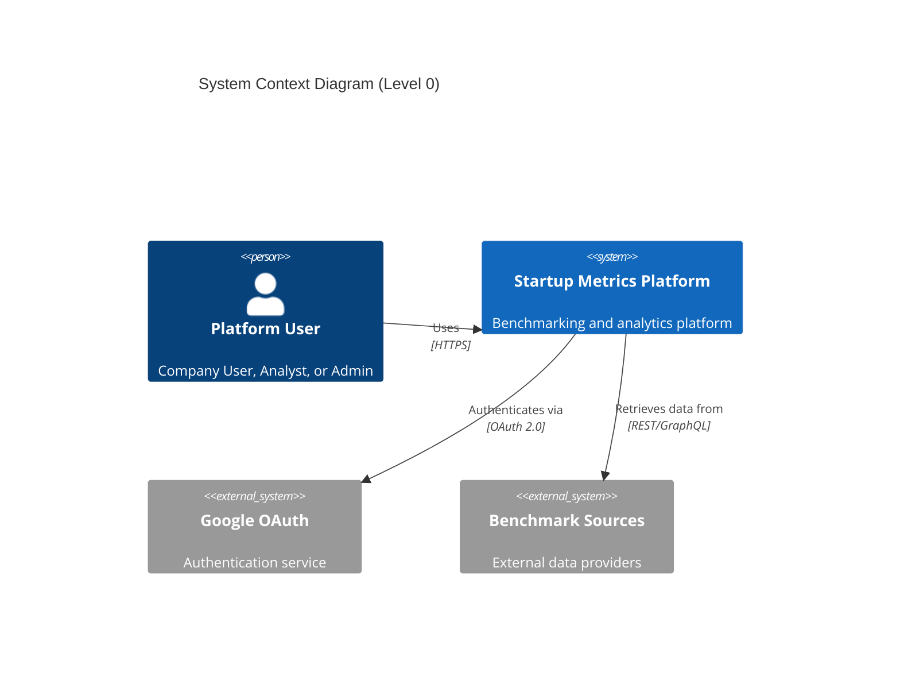

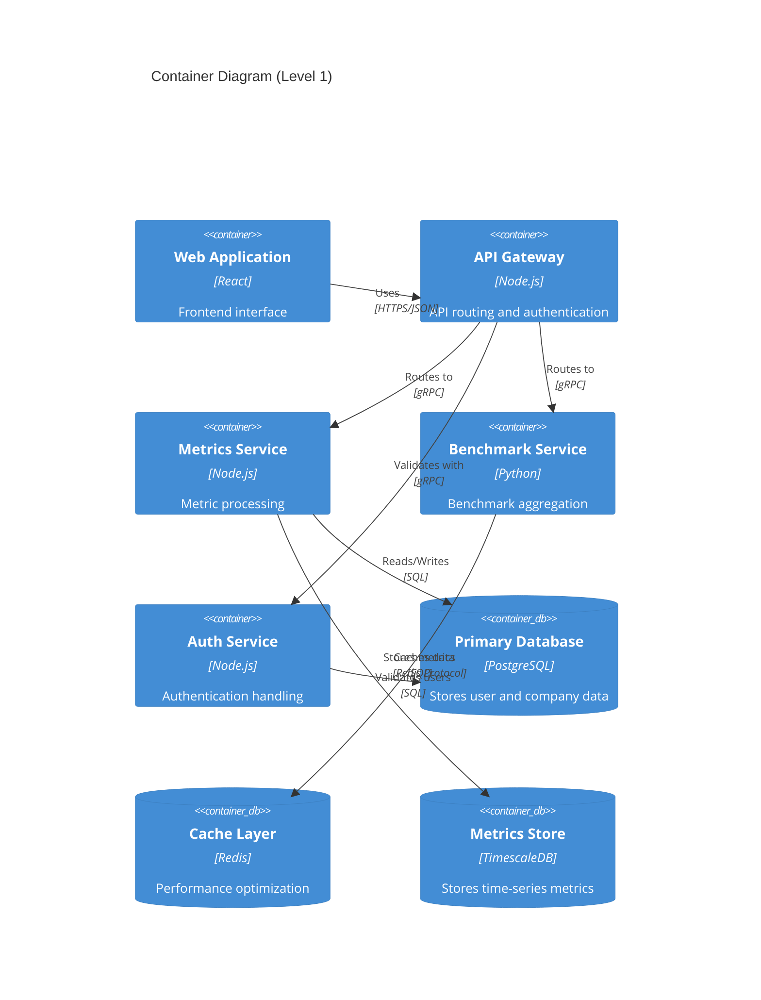

## 2.2 COMPONENT DETAILS

| Component | Purpose | Technology Stack | Scaling Strategy |
|-----------|---------|-----------------|------------------|
| Web Application | User interface and interaction | React, Redux, Material-UI | Horizontal scaling with CDN |
| API Gateway | Request routing and authentication | Node.js, Express | Auto-scaling based on load |
| Metrics Service | Metric processing and analysis | Node.js, gRPC | Horizontal scaling with load balancing |
| Benchmark Service | Benchmark data aggregation | Python, FastAPI | Horizontal scaling with load balancing |
| Auth Service | Authentication and authorization | Node.js, Passport | Replicated for high availability |

### Data Storage Components

| Component | Technology | Purpose | Scaling Strategy |
|-----------|------------|---------|------------------|
| Primary Database | PostgreSQL 14 | User and company data | Primary-replica configuration |
| Metrics Store | TimescaleDB | Time-series metric data | Partitioning by time |
| Cache Layer | Redis Cluster | Performance optimization | Multi-node clustering |

## 2.3 TECHNICAL DECISIONS

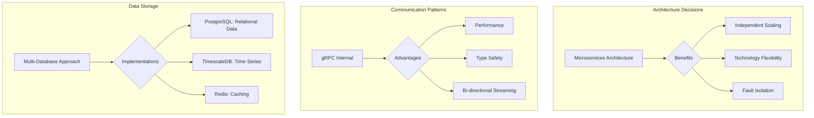

## 2.4 CROSS-CUTTING CONCERNS

### Monitoring and Observability

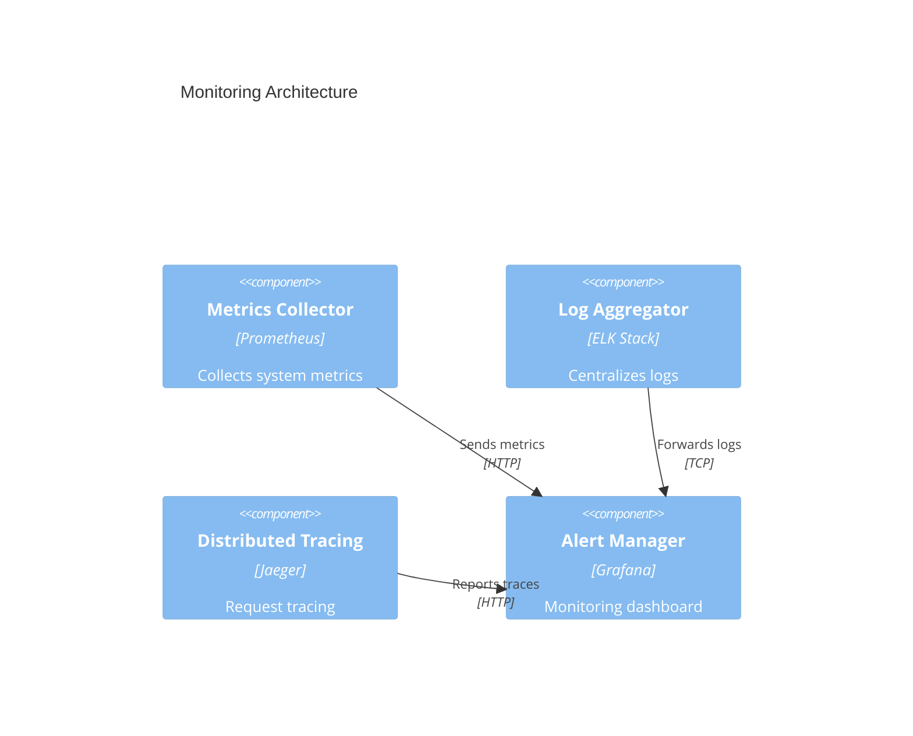

### Security Architecture

```mermaid
flowchart TD
    subgraph Security Zones
        A[Public Zone] --> B[WAF/DDoS Protection]
        B --> C[Load Balancer]
        C --> D[Application Zone]
        D --> E[Database Zone]
    end
    
    subgraph Authentication Flow
        F[OAuth Request] --> G[Token Validation]
        G --> H[Role Assignment]
        H --> I[Permission Check]
    end
    
    subgraph Data Security
        J[TLS 1.3] --> K[Field-level Encryption]
        K --> L[At-rest Encryption]
    end
```

## 2.5 DEPLOYMENT ARCHITECTURE

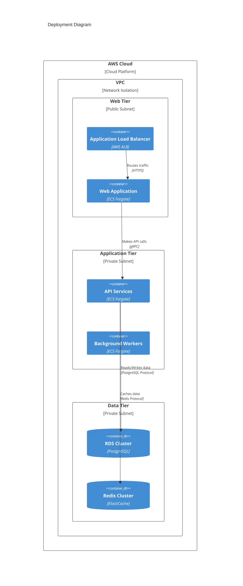

# 3. SYSTEM COMPONENTS ARCHITECTURE

## 3.1 USER INTERFACE DESIGN

### 3.1.1 Design Specifications

| Category | Requirements |
|----------|--------------|
| Visual Hierarchy | - F-pattern layout for dashboards<br>- Z-pattern for landing pages<br>- Consistent spacing (8px grid system)<br>- Maximum 3 levels of information depth |
| Component Library | - Material Design-based custom components<br>- Atomic design methodology<br>- Reusable widget system<br>- Standardized data visualization components |
| Responsive Design | - Breakpoints: 320px, 768px, 1024px, 1440px<br>- Mobile-first approach<br>- Fluid typography (16px-20px base)<br>- Collapsible navigation on mobile |
| Accessibility | - WCAG 2.1 Level AA compliance<br>- Minimum contrast ratio 4.5:1<br>- Keyboard navigation support<br>- Screen reader compatibility |
| Browser Support | - Chrome (last 2 versions)<br>- Firefox (last 2 versions)<br>- Safari (last 2 versions)<br>- Edge (last 2 versions) |
| Theme Support | - Light/dark mode toggle<br>- White-label theming system<br>- CSS custom properties for theming<br>- System preference detection |

### 3.1.2 Interface Elements

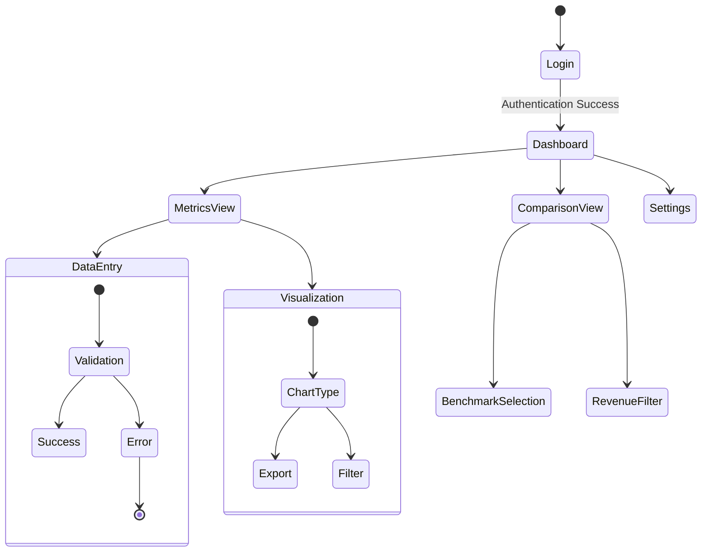

### 3.1.3 Form Validation Rules

| Field Type | Validation Rules |
|------------|------------------|
| Metric Values | - Numeric only<br>- Range validation per metric<br>- Required field handling<br>- Decimal precision limits |
| Date Inputs | - Valid date range<br>- Future date restrictions<br>- Period consistency checks<br>- Required timeframe validation |
| Revenue Range | - Predefined range selection<br>- Logical range validation<br>- Currency format validation<br>- Range overlap prevention |

## 3.2 DATABASE DESIGN

### 3.2.1 Schema Design

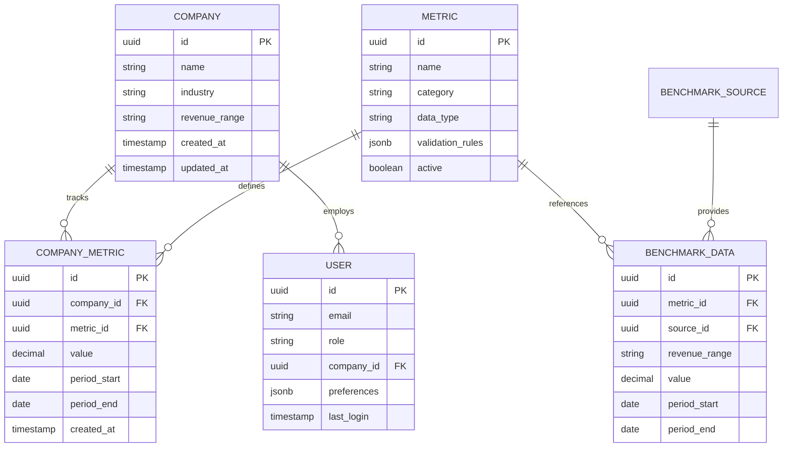

### 3.2.2 Data Management Strategy

| Aspect | Implementation |
|--------|----------------|
| Partitioning | - Time-based partitioning for metrics<br>- Range partitioning for benchmark data<br>- Hash partitioning for large tables |
| Indexing | - B-tree indexes for lookups<br>- GiST indexes for range queries<br>- Partial indexes for active records |
| Archival | - 3-month rolling window for active data<br>- Yearly archival for historical data<br>- Compressed storage for archives |
| Backup | - Daily incremental backups<br>- Weekly full backups<br>- Point-in-time recovery capability |

## 3.3 API DESIGN

### 3.3.1 API Architecture

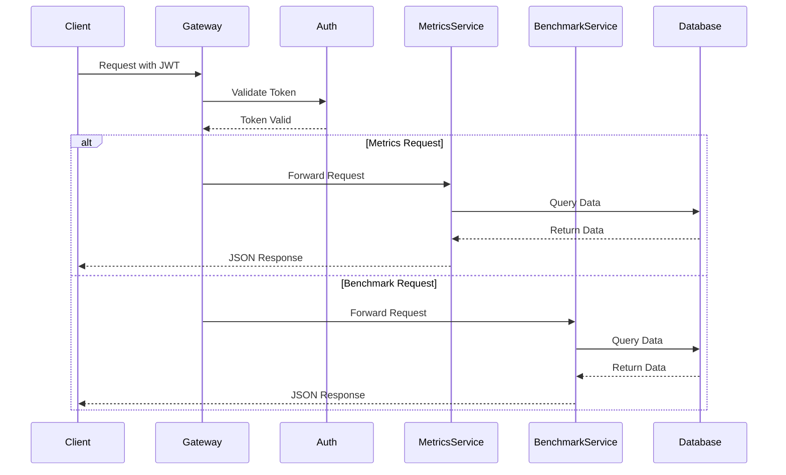

### 3.3.2 API Specifications

| Endpoint | Method | Purpose | Rate Limit |
|----------|--------|---------|------------|
| `/api/v1/metrics` | GET | Retrieve company metrics | 1000/hour |
| `/api/v1/metrics` | POST | Create new metric entry | 100/hour |
| `/api/v1/benchmarks` | GET | Retrieve benchmark data | 1000/hour |
| `/api/v1/companies` | GET | List companies | 100/hour |

### 3.3.3 Authentication Flow

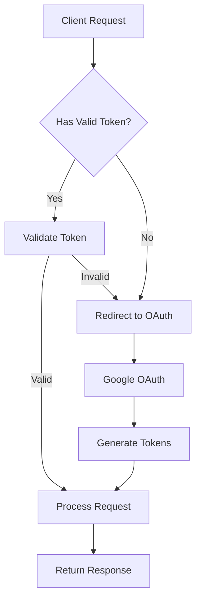

# 4. TECHNOLOGY STACK

## 4.1 PROGRAMMING LANGUAGES

| Platform/Component | Language | Version | Justification |
|-------------------|----------|---------|---------------|
| Frontend | TypeScript | 5.0+ | - Strong typing for large-scale applications<br>- Enhanced IDE support<br>- Better maintainability |
| Backend Services | Node.js | 20 LTS | - Excellent performance for API services<br>- Rich ecosystem<br>- JavaScript/TypeScript code sharing |
| Data Processing | Python | 3.11+ | - Superior data processing libraries<br>- Benchmark calculation efficiency<br>- Machine learning capabilities |
| Infrastructure | Go | 1.21+ | - High-performance microservices<br>- Excellent concurrency<br>- Low resource utilization |

## 4.2 FRAMEWORKS & LIBRARIES

### Frontend Stack

| Component | Technology | Version | Purpose |
|-----------|------------|---------|----------|
| Core Framework | React | 18.2+ | - Component-based architecture<br>- Virtual DOM performance<br>- Extensive ecosystem |
| State Management | Redux Toolkit | 1.9+ | - Predictable state updates<br>- DevTools integration<br>- TypeScript support |
| UI Components | Material-UI | 5.14+ | - Consistent design system<br>- Accessibility compliance<br>- Customization options |
| Data Visualization | D3.js | 7.8+ | - Custom chart requirements<br>- Interactive visualizations<br>- SVG-based rendering |
| Form Handling | React Hook Form | 7.45+ | - Performance optimization<br>- Built-in validation<br>- TypeScript integration |

### Backend Stack

| Component | Technology | Version | Purpose |
|-----------|------------|---------|----------|
| API Framework | Express | 4.18+ | - REST API support<br>- Middleware ecosystem<br>- Performance optimization |
| GraphQL Server | Apollo Server | 4.9+ | - Efficient data querying<br>- Type safety<br>- Real-time capabilities |
| Validation | Joi | 17.9+ | - Schema validation<br>- Type coercion<br>- Custom validation rules |
| ORM | Prisma | 5.2+ | - Type-safe database queries<br>- Migration management<br>- Multi-database support |

## 4.3 DATABASES & STORAGE

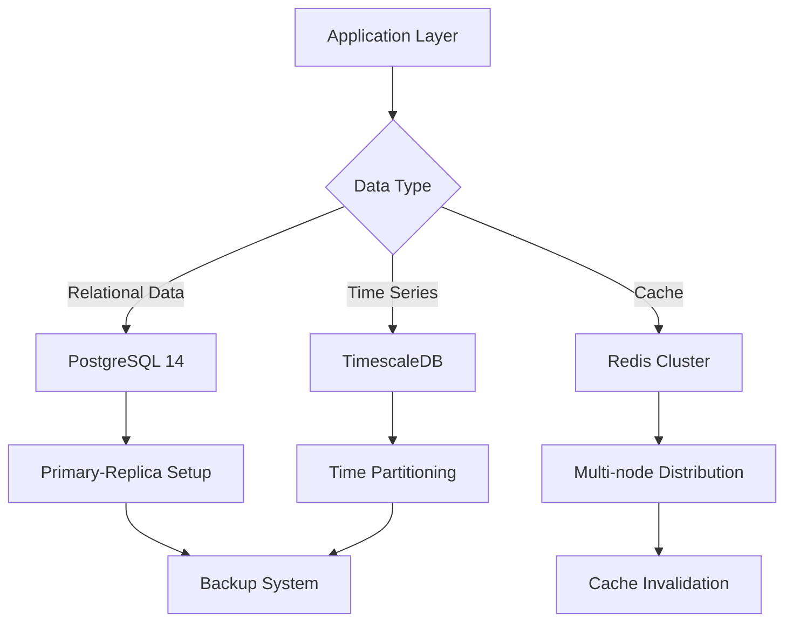

| Database Type | Technology | Purpose | Configuration |
|--------------|------------|---------|---------------|
| Primary Database | PostgreSQL 14 | - User data<br>- Company information<br>- Metric definitions | - Primary-replica setup<br>- Point-in-time recovery<br>- WAL archiving |
| Time Series DB | TimescaleDB | - Metric history<br>- Benchmark data<br>- Performance data | - Automated partitioning<br>- Retention policies<br>- Continuous aggregates |
| Cache Layer | Redis Cluster | - Session data<br>- API response cache<br>- Real-time updates | - Multi-node setup<br>- AOF persistence<br>- Automatic failover |

## 4.4 THIRD-PARTY SERVICES

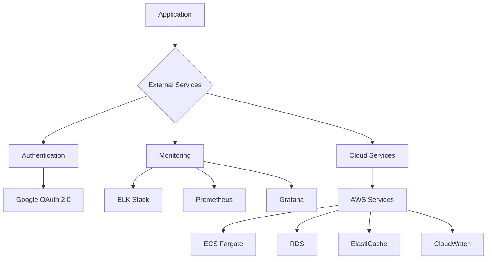

## 4.5 DEVELOPMENT & DEPLOYMENT

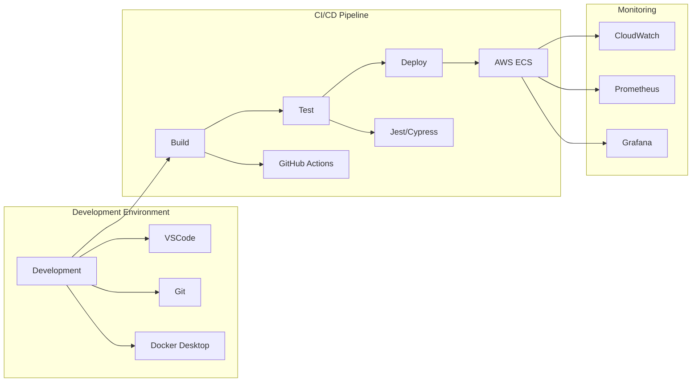

| Category | Tool | Version | Purpose |
|----------|------|---------|----------|
| IDE | VSCode | Latest | - TypeScript integration<br>- Debug support<br>- Extension ecosystem |
| Version Control | Git | 2.40+ | - Code versioning<br>- Branch management<br>- Collaboration |
| Containerization | Docker | 24.0+ | - Development consistency<br>- Service isolation<br>- Deployment packaging |
| CI/CD | GitHub Actions | N/A | - Automated testing<br>- Deployment automation<br>- Environment management |
| Infrastructure | Terraform | 1.5+ | - Infrastructure as code<br>- Multi-cloud support<br>- State management |

# 5. SYSTEM DESIGN

## 5.1 USER INTERFACE DESIGN

### 5.1.1 Layout Structure

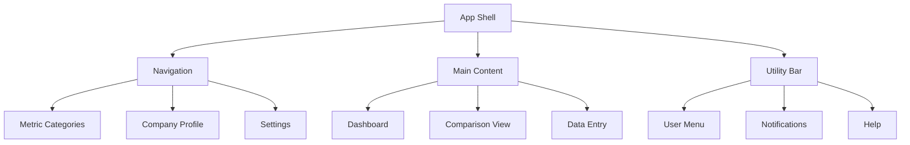

### 5.1.2 Component Hierarchy

| Component Level | Elements | Purpose |
|----------------|----------|----------|
| Primary Navigation | - Logo/Brand<br>- Main Menu<br>- User Profile | Main navigation structure |
| Content Area | - Dashboard Grid<br>- Data Tables<br>- Chart Containers | Primary content display |
| Utility Components | - Filter Controls<br>- Export Options<br>- Action Buttons | User interactions |

### 5.1.3 Responsive Breakpoints

| Breakpoint | Layout Adjustments |
|------------|-------------------|
| Mobile (<768px) | - Collapsed navigation<br>- Single column layout<br>- Stacked charts |
| Tablet (768-1024px) | - Expandable navigation<br>- Two column layout<br>- Grid-based charts |
| Desktop (>1024px) | - Persistent navigation<br>- Multi-column layout<br>- Flexible chart grid |

## 5.2 DATABASE DESIGN

### 5.2.1 Schema Design

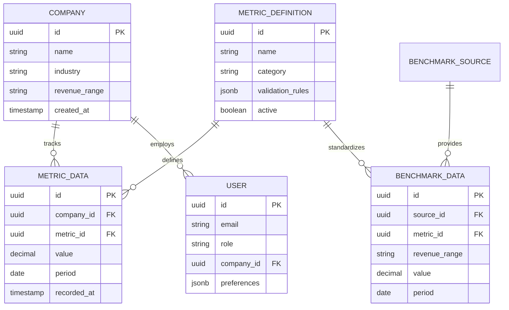

### 5.2.2 Indexing Strategy

| Table | Index Type | Columns | Purpose |
|-------|------------|---------|----------|
| METRIC_DATA | B-tree | (company_id, metric_id, period) | Efficient metric retrieval |
| BENCHMARK_DATA | B-tree | (revenue_range, metric_id, period) | Benchmark lookups |
| USER | Hash | email | User authentication |
| METRIC_DEFINITION | B-tree | category | Category filtering |

## 5.3 API DESIGN

### 5.3.1 API Architecture

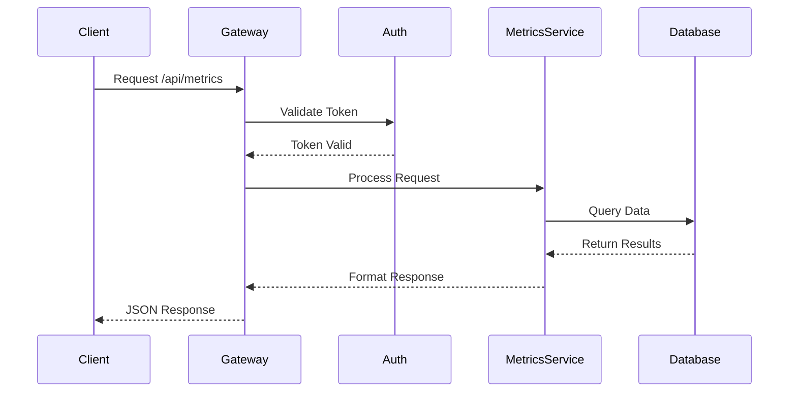

### 5.3.2 Endpoint Specifications

| Endpoint | Method | Purpose | Request Format | Response Format |
|----------|--------|---------|----------------|-----------------|
| /api/v1/metrics | GET | Retrieve metrics | Query params for filtering | JSON array of metrics |
| /api/v1/metrics | POST | Create metric entry | JSON metric data | Created metric object |
| /api/v1/benchmarks | GET | Get benchmark data | Query params for range | JSON benchmark data |
| /api/v1/companies | GET | List companies | Pagination params | JSON array of companies |

### 5.3.3 Authentication Flow

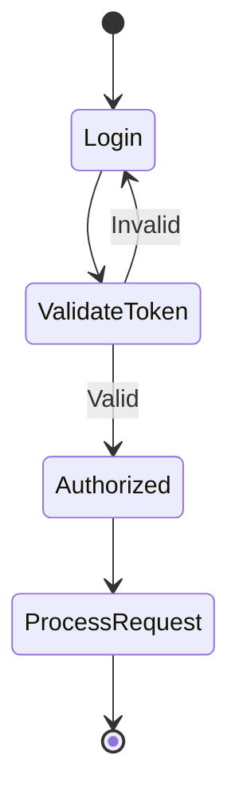

### 5.3.4 Rate Limiting

| Endpoint Category | Rate Limit | Window | Burst Allowance |
|------------------|------------|--------|-----------------|
| Public APIs | 100 | Per minute | 150 |
| Authenticated APIs | 1000 | Per hour | 1200 |
| Admin APIs | 5000 | Per hour | 6000 |

# 6. USER INTERFACE DESIGN

## 6.1 WIREFRAME KEY

| Symbol | Meaning |
|--------|---------|
| [#] | Dashboard/Menu |
| [@] | User Profile |
| [$] | Financial Data |
| [?] | Help/Documentation |
| [+] | Add New Item |
| [x] | Close/Delete |
| [<][>] | Navigation |
| [^] | Upload Data |
| [!] | Alert/Warning |
| [=] | Settings |
| [*] | Important/Favorite |
| [ ] | Checkbox |
| ( ) | Radio Button |
| [...] | Text Input |
| [v] | Dropdown Menu |
| [====] | Progress Bar |

## 6.2 MAIN DASHBOARD

```
+----------------------------------------------------------+
|  [#] Startup Metrics Platform             [@] Admin [=]    |
+----------------------------------------------------------+
|        |                                                   |
| [#]    |   Revenue Overview                    [*][?]     |
| Dashboard  +----------------------------------------+     |
|        |   |  ARR: $1.2M         Growth: 125% YoY  |     |
| [$]    |   |  [====================================]|     |
| Metrics |   +----------------------------------------+     |
|        |                                                   |
| [^]    |   Benchmark Comparison                    [+]    |
| Import |   +----------------------------------------+     |
|        |   | Revenue Range: [...................] [v]|     |
| [!]    |   | Data Source:   [...................] [v]|     |
| Alerts |   +----------------------------------------+     |
|        |                                                   |
| [@]    |   Key Metrics                          [>][<]    |
| Profile|   +----------------+  +------------------+        |
|        |   | NDR           |  | CAC Payback      |        |
+--------+   | 112%          |  | 18 months        |        |
             +----------------+  +------------------+        |
```

## 6.3 METRIC ENTRY FORM

```
+----------------------------------------------------------+
|  [$] New Metric Entry                         [x] Close    |
+----------------------------------------------------------+
|                                                           |
|  Metric Category [v]                                      |
|  +------------------------------------------------+      |
|  | ( ) Revenue    ( ) Retention    ( ) Expenses    |      |
|  | ( ) Growth     ( ) Sales        ( ) Other       |      |
|  +------------------------------------------------+      |
|                                                           |
|  Metric Value                                            |
|  +------------------------------------------------+      |
|  | [.....................] [v] Units               |      |
|  +------------------------------------------------+      |
|                                                           |
|  Time Period                                             |
|  +------------------------------------------------+      |
|  | Start: [.......] End: [.......] [!] Required   |      |
|  +------------------------------------------------+      |
|                                                           |
|  [ ] Save as recurring metric                            |
|                                                           |
|  [Cancel]                              [Save Metric]      |
+----------------------------------------------------------+
```

## 6.4 BENCHMARK COMPARISON VIEW

```
+----------------------------------------------------------+
|  [$] Benchmark Analysis                    [@] Export      |
+----------------------------------------------------------+
|                                                           |
|  Revenue Range Selection                                  |
|  +------------------------------------------------+      |
|  | [v] $1M - $5M ARR                              |      |
|  +------------------------------------------------+      |
|                                                           |
|  Metric Selection                                         |
|  +------------------------------------------------+      |
|  | [x] ARR Growth     [x] NDR     [ ] CAC Payback |      |
|  | [ ] Gross Margins  [x] LTV     [ ] Burn Rate   |      |
|  +------------------------------------------------+      |
|                                                           |
|  Comparison View                                          |
|  +------------------------------------------------+      |
|  | Metric      | Your Data | Benchmark | Variance  |      |
|  |-------------|-----------|------------|-----------|      |
|  | ARR Growth  | 125%      | 89%        | +36%     |      |
|  | NDR        | 112%      | 106%       | +6%      |      |
|  | LTV        | $85K      | $92K       | -$7K     |      |
|  +------------------------------------------------+      |
|                                                           |
|  [Download CSV]                    [Share Report]         |
+----------------------------------------------------------+
```

## 6.5 SETTINGS PANEL

```
+----------------------------------------------------------+
|  [=] System Settings                        [x] Close      |
+----------------------------------------------------------+
|                                                           |
|  Display Preferences                                      |
|  +------------------------------------------------+      |
|  | [ ] Dark Mode                                   |      |
|  | [ ] Compact View                                |      |
|  | [ ] Show Tooltips                               |      |
|  +------------------------------------------------+      |
|                                                           |
|  Data Visualization                                       |
|  +------------------------------------------------+      |
|  | Chart Type: [v] Line Chart                      |      |
|  | Default Period: [v] Quarterly                   |      |
|  | Currency: [v] USD                               |      |
|  +------------------------------------------------+      |
|                                                           |
|  Notifications                                           |
|  +------------------------------------------------+      |
|  | [ ] Email Alerts                                |      |
|  | [ ] Benchmark Updates                           |      |
|  | [ ] System Notifications                        |      |
|  +------------------------------------------------+      |
|                                                           |
|  [Reset Defaults]                          [Save]         |
+----------------------------------------------------------+
```

## 6.6 RESPONSIVE DESIGN BREAKPOINTS

| Breakpoint | Layout Adjustments |
|------------|-------------------|
| Mobile (<768px) | - Single column layout<br>- Collapsible sidebar<br>- Stacked metric cards<br>- Simplified charts |
| Tablet (768-1024px) | - Two column layout<br>- Mini sidebar<br>- Grid-based metric cards<br>- Standard charts |
| Desktop (>1024px) | - Full layout<br>- Expanded sidebar<br>- Dashboard grid<br>- Advanced visualizations |

## 6.7 INTERACTION PATTERNS

| Component | Interaction |
|-----------|------------|
| Navigation | - Hover reveals submenus<br>- Active state highlighting<br>- Breadcrumb navigation |
| Data Entry | - Real-time validation<br>- Auto-save drafts<br>- Inline error messages |
| Charts | - Click-through for details<br>- Zoom controls<br>- Export options |
| Filters | - Multi-select capabilities<br>- Quick clear options<br>- Save filter presets |

# 7. SECURITY CONSIDERATIONS

## 7.1 AUTHENTICATION AND AUTHORIZATION

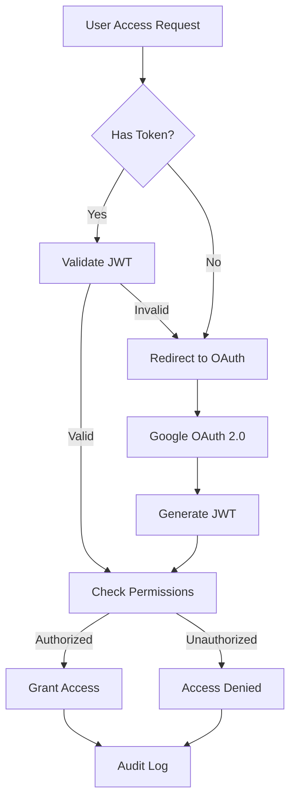

| Authentication Method | Implementation Details | Security Measures |
|----------------------|------------------------|-------------------|
| Google OAuth 2.0 | - OAuth 2.0 protocol with PKCE<br>- JWT tokens with 1-hour expiry<br>- Refresh tokens with 30-day expiry | - SSL/TLS encryption<br>- Token rotation<br>- Secure cookie handling |
| Session Management | - Redis session store<br>- 30-minute idle timeout<br>- Device fingerprinting | - Session invalidation on logout<br>- Concurrent session limits<br>- IP-based suspicious activity detection |
| Role-Based Access | - Company User role<br>- Analyst role<br>- Admin role | - Least privilege principle<br>- Regular permission audits<br>- Role hierarchy enforcement |

## 7.2 DATA SECURITY

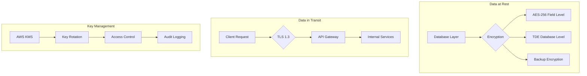

| Security Layer | Implementation | Protection Measures |
|----------------|----------------|-------------------|
| Data at Rest | - AES-256 encryption<br>- Transparent Data Encryption (TDE)<br>- Encrypted backups | - Key rotation every 90 days<br>- Secure key storage in AWS KMS<br>- Encrypted database volumes |
| Data in Transit | - TLS 1.3 protocol<br>- Perfect Forward Secrecy<br>- Strong cipher suites | - Certificate pinning<br>- HSTS enforcement<br>- Secure WebSocket connections |
| Data Access | - Row-level security<br>- Column-level encryption<br>- Data masking | - Audit logging<br>- Access monitoring<br>- Data classification |

## 7.3 SECURITY PROTOCOLS

| Protocol Category | Implementation Details | Compliance Standards |
|------------------|------------------------|---------------------|
| Network Security | - WAF implementation<br>- DDoS protection<br>- Network segmentation | - OWASP Top 10<br>- CIS benchmarks<br>- ISO 27001 |
| API Security | - Rate limiting<br>- Input validation<br>- Request signing | - API security best practices<br>- OAuth 2.0 specifications<br>- OpenAPI 3.0 standards |
| Monitoring | - Real-time threat detection<br>- Security event logging<br>- Intrusion detection | - SOC 2 requirements<br>- SIEM integration<br>- 24/7 monitoring |

### 7.3.1 Security Controls Matrix

| Control Type | Implementation | Monitoring |
|--------------|----------------|------------|
| Preventive | - Input validation<br>- Access controls<br>- Encryption | Daily automated scans |
| Detective | - Audit logging<br>- Intrusion detection<br>- File integrity monitoring | Real-time alerts |
| Corrective | - Automated blocking<br>- Session termination<br>- System restoration | Incident response procedures |

### 7.3.2 Compliance Requirements

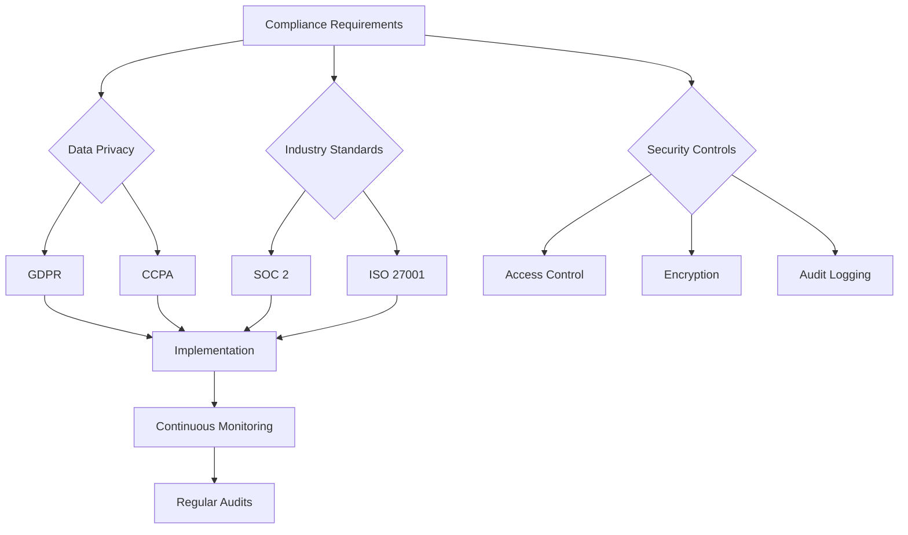

# 8. INFRASTRUCTURE

## 8.1 DEPLOYMENT ENVIRONMENT

```mermaid
flowchart TD
    A[Production Environment] --> B[AWS Cloud]
    A --> C[Staging Environment]
    A --> D[Development Environment]
    
    B --> E[Multi-AZ Deployment]
    E --> F[us-east-1]
    E --> G[us-west-2]
    
    C --> H[Single AZ Deployment]
    D --> I[Local Development]
    
    F --> J[Public Subnet]
    F --> K[Private Subnet]
    F --> L[Database Subnet]
    
    G --> M[Disaster Recovery]
```

| Environment | Purpose | Configuration |
|------------|---------|---------------|
| Production | Live system serving end users | - Multi-AZ deployment<br>- Auto-scaling enabled<br>- Full redundancy |
| Staging | Pre-production testing | - Single AZ deployment<br>- Limited scaling<br>- Production mirror |
| Development | Developer testing | - Local or cloud-based<br>- Minimal infrastructure<br>- Debug capabilities |

## 8.2 CLOUD SERVICES

| Service | Purpose | Configuration |
|---------|---------|---------------|
| AWS ECS Fargate | Container orchestration | - Task definitions for each service<br>- Auto-scaling policies<br>- Service discovery enabled |
| AWS RDS | PostgreSQL database | - Multi-AZ deployment<br>- Instance type: db.r6g.xlarge<br>- Automated backups |
| AWS ElastiCache | Redis caching | - Cluster mode enabled<br>- Instance type: cache.r6g.large<br>- Multi-AZ replication |
| AWS CloudFront | CDN | - Edge locations worldwide<br>- HTTPS enforcement<br>- Custom domain support |
| AWS KMS | Key management | - Automatic key rotation<br>- CMK for sensitive data<br>- Audit logging enabled |

## 8.3 CONTAINERIZATION

```mermaid
graph TD
    subgraph Container Architecture
        A[Base Image] --> B[Node.js Runtime]
        A --> C[Python Runtime]
        
        B --> D[API Services]
        B --> E[Auth Service]
        C --> F[Benchmark Service]
        
        D --> G[Production Image]
        E --> G
        F --> G
    end
    
    subgraph Image Management
        H[ECR Repository] --> I[Version Tags]
        I --> J[Production]
        I --> K[Staging]
        I --> L[Development]
    end
```

| Component | Configuration | Resources |
|-----------|--------------|-----------|
| Base Image | Alpine Linux | 256MB RAM baseline |
| API Services | Node.js 20 | 1GB RAM, 0.5 vCPU |
| Auth Service | Node.js 20 | 512MB RAM, 0.25 vCPU |
| Benchmark Service | Python 3.11 | 2GB RAM, 1 vCPU |

## 8.4 ORCHESTRATION

```mermaid
flowchart TD
    A[ECS Cluster] --> B{Service Types}
    B --> C[API Services]
    B --> D[Auth Service]
    B --> E[Benchmark Service]
    
    C --> F[Task Definition]
    D --> G[Task Definition]
    E --> H[Task Definition]
    
    F --> I[Auto-scaling]
    G --> I
    H --> I
    
    I --> J[CloudWatch Metrics]
    J --> K[Scaling Policies]
```

| Service | Scaling Policy | Health Check |
|---------|---------------|--------------|
| API Services | 50-80% CPU utilization | HTTP/200 every 30s |
| Auth Service | Request count based | TCP/3000 every 15s |
| Benchmark Service | Memory utilization | HTTP/200 every 45s |

## 8.5 CI/CD PIPELINE

```mermaid
flowchart LR
    A[Source Code] --> B[GitHub Actions]
    B --> C{Build Phase}
    C --> D[Unit Tests]
    C --> E[Integration Tests]
    C --> F[Security Scan]
    
    D --> G{Quality Gate}
    E --> G
    F --> G
    
    G -->|Pass| H[Build Images]
    G -->|Fail| I[Notify Team]
    
    H --> J{Environment}
    J --> K[Deploy to Dev]
    J --> L[Deploy to Staging]
    J --> M[Deploy to Prod]
    
    K --> N[Automated Tests]
    L --> N
    M --> O[Health Checks]
```

| Stage | Tools | SLAs |
|-------|-------|------|
| Build | GitHub Actions | < 10 minutes |
| Test | Jest, Cypress | 90% coverage |
| Security | SonarQube, OWASP | Zero high vulnerabilities |
| Deploy | AWS CodeDeploy | < 15 minutes |
| Validation | Automated test suite | 100% pass rate |

### Deployment Strategy

| Environment | Strategy | Rollback Time |
|------------|----------|---------------|
| Development | Direct deployment | Immediate |
| Staging | Blue/Green | < 5 minutes |
| Production | Blue/Green with canary | < 10 minutes |

# APPENDICES

## A.1 ADDITIONAL TECHNICAL INFORMATION

### A.1.1 Metric Calculation Formulas

| Metric | Formula | Validation Rules |
|--------|---------|-----------------|
| Net Dollar Retention | (Starting ARR + Expansions - Contractions - Churn) / Starting ARR | > 0%, < 200% |
| Magic Number | Net New ARR / (S&M Spend from Previous Quarter) | > 0, < 10 |
| CAC Payback Period | CAC / (ARPA * Gross Margin) | > 0 months, < 60 months |
| Pipeline Coverage | Total Pipeline Value / Revenue Target | > 1x, < 10x |

### A.1.2 Data Source Integration Flow

```mermaid
flowchart TD
    A[Benchmark Sources] --> B{Data Ingestion}
    B --> C[Validation Layer]
    B --> D[Transformation Layer]
    
    C --> E[Schema Validation]
    C --> F[Business Rule Check]
    
    D --> G[Normalization]
    D --> H[Revenue Range Mapping]
    
    E --> I[Data Storage]
    F --> I
    G --> I
    H --> I
    
    I --> J[Versioning System]
    I --> K[Audit Trail]
```

## A.2 GLOSSARY

| Term | Definition |
|------|------------|
| Annual Recurring Revenue (ARR) | Total value of recurring revenue normalized to a yearly amount |
| Benchmark Source | External provider of industry standard performance metrics |
| Churn | Loss of existing revenue from customer cancellations |
| Expansion Revenue | Additional revenue from existing customers |
| Gross Margin | Revenue minus cost of goods sold, expressed as a percentage |
| Revenue Range | Defined band of annual revenue used for peer comparison |
| Side-by-Side Comparison | Direct visual comparison of metrics from multiple sources |
| Time Series Data | Data points collected at regular time intervals |
| White-Label | Capability to rebrand the platform for different clients |

## A.3 ACRONYMS

| Acronym | Full Form |
|---------|-----------|
| API | Application Programming Interface |
| ARPA | Average Revenue Per Account |
| ARR | Annual Recurring Revenue |
| CAC | Customer Acquisition Cost |
| CCPA | California Consumer Privacy Act |
| CDN | Content Delivery Network |
| GDPR | General Data Protection Regulation |
| JWT | JSON Web Token |
| NDR | Net Dollar Retention |
| RBAC | Role-Based Access Control |
| REST | Representational State Transfer |
| RTO | Recovery Time Objective |
| S&M | Sales and Marketing |
| SaaS | Software as a Service |
| SOC | System and Organization Controls |
| TLS | Transport Layer Security |
| UI/UX | User Interface/User Experience |
| WAF | Web Application Firewall |
| WCAG | Web Content Accessibility Guidelines |
| YoY | Year over Year |